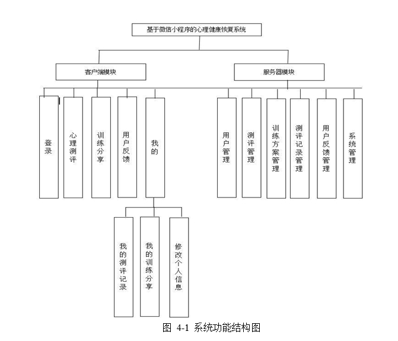
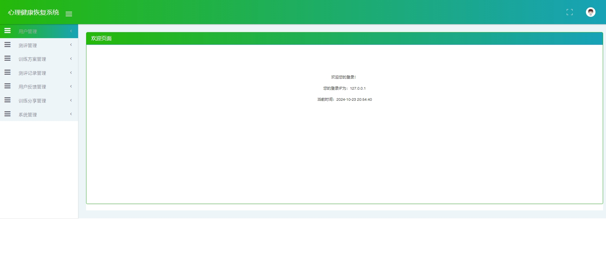
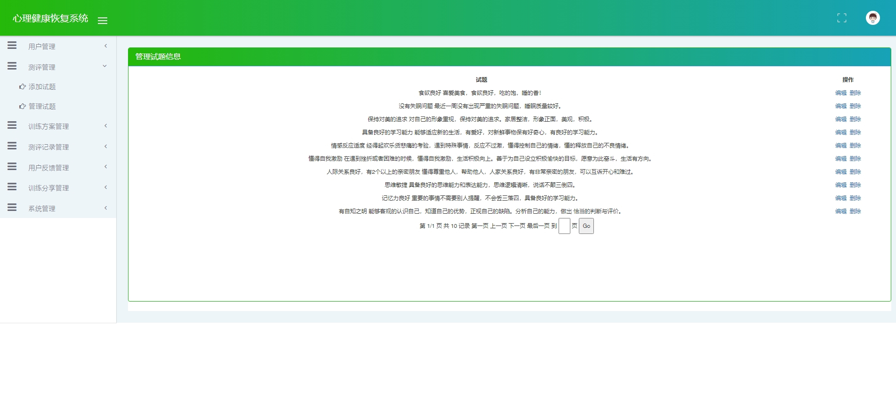
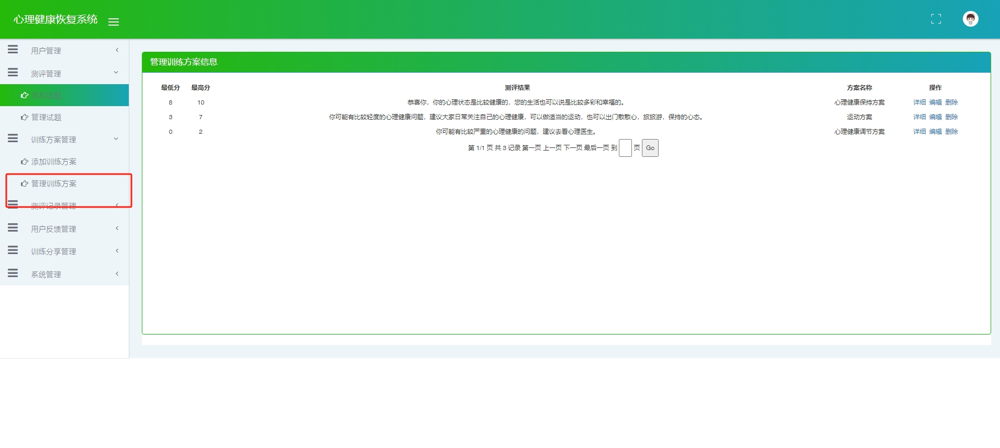
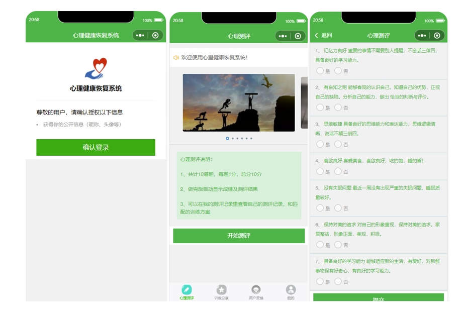
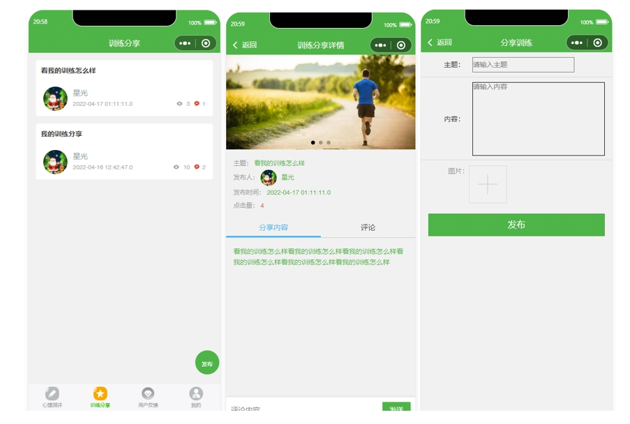
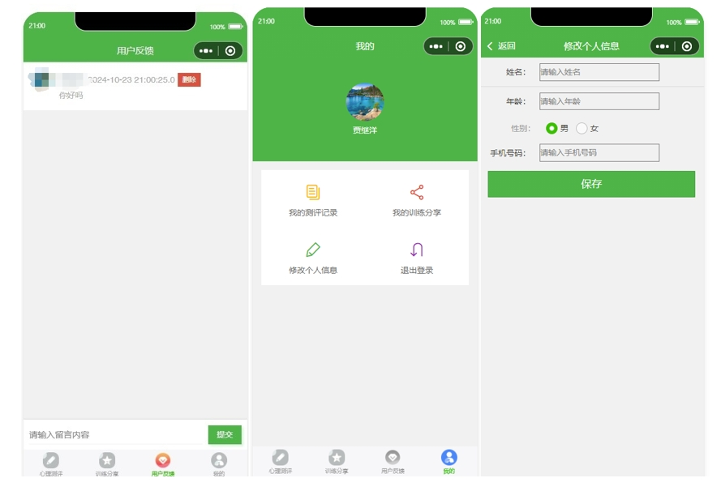
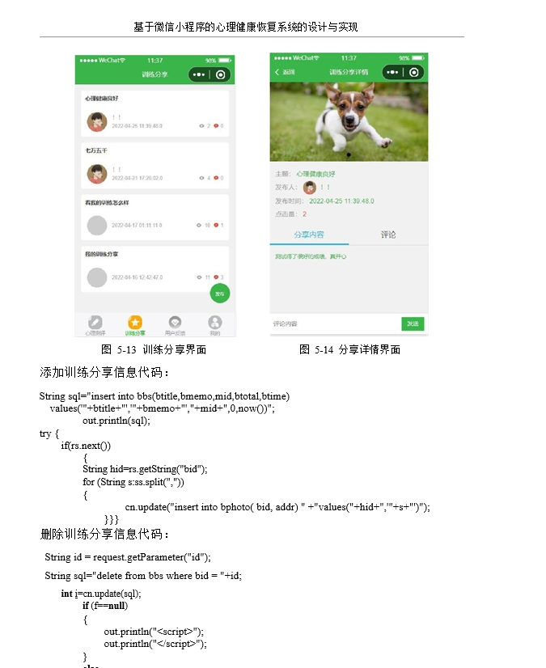
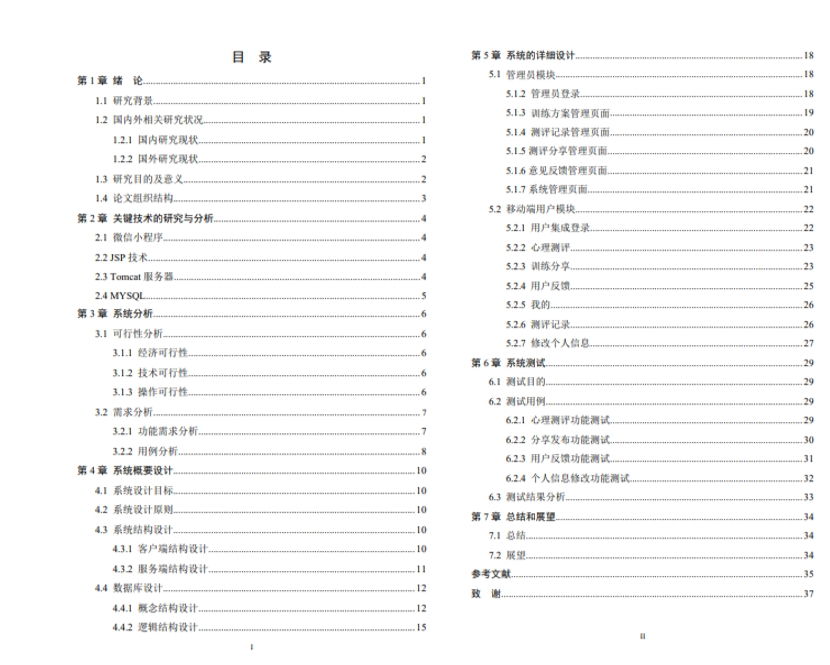

# 1.项目介绍

- 测试环境: IDEA2022, MySQL5.7+，Tomcat8.5

- 技术栈：JavaWeb，jsp

- 功能模块：心理测评、训练分类、测评管理、训练方案、测评记录、系统管理、用户管理、个人中心

# 2.项目部署
## 2.1 后端
- 通过Navicat创建数据库，编码utf8mb4
- 导入chegnxu\xinlijiankangServer\db目录下的sql文件
- 根据本地数据库环境，修改src/com/db/conn.java  19,24-27行
- 配置tomcat，其中deployment的ApplicationContext配置为/xinlijiankangServer（和小程序请求url一致就行）
- 手动配置jar包，右键web/WEB-INF/lib， add as library
- 启动tomcat，http://localhost:8080/xinlijiankangServer管理员账号密码： admin/1（可以自行查询数据库）
## 2.2 小程序部署
- 微信开发工具打开xinlijiankang
- appid选择测试号即可
- 运行，登录账号自行查询数据库
# 3.项目部分截图

# 4.获取方式
[戳我查看](https://gitee.com/aven999/mall)